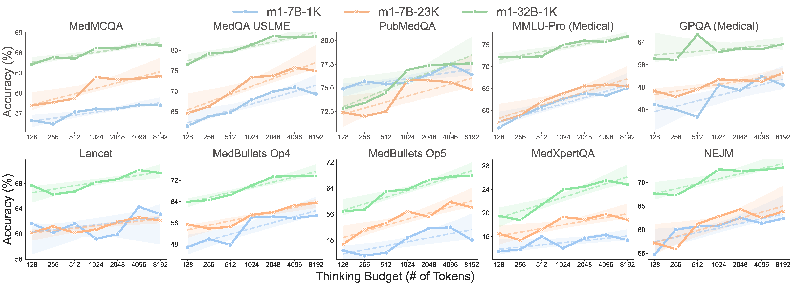

<div align="center">
<h1>
  <b>m1</b>: Unleash the Potential of Test-Time Scaling for Medical Reasoning in Large Language Models
</h1>
<p>
A simple test-time scaling strategy, with minimal fine-tuning, can unlock strong medical reasoning within large language models.
</p>
</div>

## ⚡ Introduction



Hi! Welcome to the repository for **m1** (📃 [Paper](https://arxiv.org/abs/2504.00869))!

**m1** is a medical LLM designed to enhance reasoning through efficient test-time scaling. It enables lightweight models to match or exceed the performance of much larger counterparts by extending inference-time “thinking.” Unlike methods that rely on complex RL or expert supervision, m1 achieves strong results through:

- **Fine-tuning on a small, high-quality set of verified medical reasoning examples**, showing that even with just 1K–23K examples, m1-7B *surpasses* previous SOTA models like HuatuoGPT-o1-7B and UltraMedical-8B, and m1-32B *rivals* 70B-scale models.

- **Scaling reasoning at inference using token budgets**, which consistently improves performance across medical QA tasks: up to an optimal ~4K token budget, beyond which performance may degrade due to overthinking.

- **Identifying medical knowledge as the key bottleneck**, revealing that additional reasoning alone cannot overcome knowledge gaps; instead, improvements require better data quality and increased model capacity.

We open-sourced our models, data, and code here.


****************************************************************

**Updates:**

* 2025-03: We release our code, data, models, and paper!

****************************************************************

### 🌍 Environment

Please refer to [docs/ENV.md](docs/ENV.md).

### 👨‍⚕️ Models and Data

| Model            | Backbone              | Training Data                                                                 | Link                                                           |
| ---------------- | --------------------- | ----------------------------------------------------------------------------- | -------------------------------------------------------------- |
| **m1-32b-1k**     | Qwen2.5-32B-Instruct  | [m1k](https://huggingface.co/datasets/UCSC-VLAA/m1k-tokenized)                | [HF Link](https://huggingface.co/UCSC-VLAA/m1-32B-1K)          |
| **m1-7b-1k**      | Qwen2.5-7B-Instruct   | [m1k](https://huggingface.co/datasets/UCSC-VLAA/m1k-tokenized)                | [HF Link](https://huggingface.co/UCSC-VLAA/m1-7B-1K)           |
| **m1-7b-23k**     | Qwen2.5-7B-Instruct   | [m23k](https://huggingface.co/datasets/UCSC-VLAA/m23k-tokenized)              | [HF Link](https://huggingface.co/UCSC-VLAA/m1-7B-23K)          |


### 🏃 Inference

m1 can be used just like Qwen2.5-7b-Instruct. You can deploy it with tools like vllm or Sglang (we provide an example of using Sglang in [src/eval/inference_keep_think.py](src/eval/inference_keep_think.py)), or perform direct inference:

```python
from transformers import AutoModelForCausalLM, AutoTokenizer

# Load model and tokenizer
model_name = "UCSC-VLAA/m1-7B-1K"
# model_name = "UCSC-VLAA/m1-32B-1K"
# model_name = "UCSC-VLAA/m1-7B-23K"
model = AutoModelForCausalLM.from_pretrained(
    model_name, torch_dtype="float16", device_map="cuda"
)
tokenizer = AutoTokenizer.from_pretrained(model_name)


# Case No.1
input_text = "I am flying from San Francisco to Australia. How to deal with jet lag?"
messages = [{"role": "user", "content": input_text}]

inputs = tokenizer(
    tokenizer.apply_chat_template(messages, tokenize=False, add_generation_prompt=True),
    return_tensors="pt",
).to(model.device)

outputs = model.generate(**inputs, max_new_tokens=8192)
print(tokenizer.decode(outputs[0], skip_special_tokens=False).split("\\boxed")[0])


# Case No.2
input_text = """A 27-year-old woman who recently emigrated from Brazil comes to the physician because of fever, fatigue, decreased appetite, and mild abdominal discomfort. She has not seen a physician in several years and her immunization status is unknown. She drinks 2 alcoholic beverages on the weekends and does not use illicit drugs. She is sexually active with several male partners and uses condoms inconsistently. Her temperature is 38°C (99.8°F). Physical examination shows right upper quadrant tenderness and scleral icterus. Serology confirms acute infection with a virus that has partially double-stranded, circular DNA. Which of the following is most likely involved in the replication cycle of this virus?
A. Transcription of viral DNA to RNA in the cytoplasm
B. Reverse transcription of viral RNA to DNA
C. Bacterial translation of viral DNA
D. Adhesion of virus to host ICAM-1"""
messages = [{"role": "user", "content": input_text}]

inputs = tokenizer(
    tokenizer.apply_chat_template(messages, tokenize=False, add_generation_prompt=True),
    return_tensors="pt",
).to(model.device)

outputs = model.generate(**inputs, max_new_tokens=8192)
print(tokenizer.decode(outputs[0], skip_special_tokens=False).split("\\boxed")[0])
```

### 🚀 Training

To train the models, you can use our commands at `exp/train_commands.sh` to invoke sft script in `src/train/sft.py`. Remember to config `WANDB_*` environment variables in `.env` files if you want to log the training with wandb (See [docs/ENV.md](docs/ENV.md)).

### 🧐 Evaluation

We leverage `sglang` to speed up inference process.

To evaluate the models, your can use our commands at `exp/eval_commands.sh` to execute the makefiles in `exp/`, which run the script `src/eval/inference_keep_think.py`.

We provide our results in [UCSC-VLAA/m1-results](https://huggingface.co/datasets/UCSC-VLAA/m1-results).

> Our 7B model finetuned on 23K examples (m1-7B-23K) attains new state-of-the-art accuracy of 60.32% among in-domain and out-domain medical exam datasets, surpassing previously established specialized models of similar scale such as HuatuoGPT-o1-7B/8B (trained with complex RL on 40K instances) and UltraMedical-8B (trained on hundreds of thousands of medical instructions).
>
> Furthermore, our larger 32B model trained with only 1K fine-tuning samples (m1-32B-1K) achieves performance comparable to 2X bigger resource-exhausted models (around 70B parameters with high training costs).

### 📚 Data Curation

To re-produce our data, you can check the code at `src/collect_data`, `src/distill_data`, `src/select_data`, and `src/tokenize_data`:

Remember to set-up your own openai compatible API key `OPENAI_API_KEY` in `.env` (See [docs/ENV.md](docs/ENV.md)).
Change the `base_url` in `src/distill_data/distill_data.py` with your own llm api provider

Download the eval data according to [docs/ENV.md](docs/ENV.md).

Change `mmqm` to your own HF account name.

```bash
# Collect medical datasets
python src/collect_data/merge_data.py --hf_repo_id mmqm/m196k
python src/distill_data/decontaminate_eval.py --repo_id mmqm/m196k-dedup-decon
# Generate responses with LLMs
python src/distill_data/distill_data.py --repo_id mmqm/m196k-dedup-decon-decon_eval --model_name qwen-7b
python src/distill_data/distill_data.py --repo_id mmqm/m196k-dedup-decon-decon_eval --model_name qwen-32b
python src/distill_data/distill_data.py --repo_id mmqm/m196k-dedup-decon-decon_eval  --model_name qwen-r1
```

Then run commands in `src/distill_data/filtering_qwen_correct.ipynb` and `src/distill_data/filtering_r1_wrong.ipynb`

To classify the samples into different domains:

```bash
python src/select_data/build_prompt.py
python src/select_data/extract_domain.py --repo_id <last_repo_id> --upload_id <this_repo_id>
python src/select_data/classify_sample.py --repo_id <last_repo_id>
```

Run scripts in `src/select_data/select_hard_sample_by_domain_source.ipynb` to generate the 1K scale dataset.

Finally, tokenize the dataset using:

```bash
python src/tokenize_data/apply_chat_template.py --repo_id <last_repo_id>
```

### 🙏🏼 Acknowledgement


We gratefully acknowledge the inspiring work of [HuatuoGPT-o1](https://github.com/FreedomIntelligence/HuatuoGPT-o1), [s1](https://github.com/simplescaling/s1), and [open-thoughts](https://github.com/open-thoughts/open-thoughts), which laid important groundwork for this research. We also thank the developers of the excellent tools [curator](https://github.com/bespokelabsai/curator/), [trl](https://github.com/huggingface/trl), and [sglang](https://github.com/sgl-project/sglang) for making this work possible.


### 📖 Citation

```
@misc{huang2025m1UnleashPotential,
      title={m1: Unleash the Potential of Test-Time Scaling for Medical Reasoning in Large Language Models}, 
      author={Xiaoke Huang and Juncheng Wu and Hui Liu and Xianfeng Tang and Yuyin Zhou},
      year={2025},
      eprint={2504.00869},
      archivePrefix={arXiv},
      primaryClass={cs.CL},
      url={https://arxiv.org/abs/2504.00869}, 
}
```